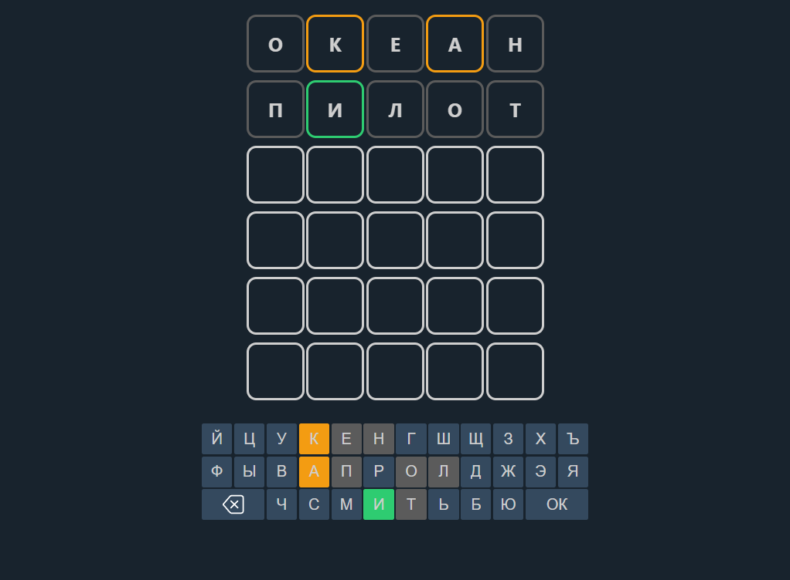

# 🔤 Клон Wordle на React на русском языке

**Wordle** — это веб-приложение-головоломка, где игроку нужно угадать слово за ограниченное количество попыток, используя подсказки о правильности букв:
- 🟩 **Зелёный** — буква на своём месте  
- 🟨 **Жёлтый** — буква есть в слове, но на другом месте  
- ⬛ **Серый** — буквы нет в слове  


## 📷 Демонстрация



Попробовать проект онлайн:  
[](https://acidless.github.io/wordle/)

## 🚀 Возможности

- ⌨️ **Управление с клавиатуры** и виртуальной клавиатуры  
- 🎨 **Подсветка букв** (зелёный/жёлтый/серый) с плавными анимациями  
- 🌀 **Случайный выбор слова** из словаря  
- 🔄 **Несколько попыток** для угадывания слова  
- 🛠️ Лёгко расширяется новыми функциями (подсказки, счётчики побед, статистика)  

## 🛠 Установка

```bash
git clone https://github.com/acidless/wordle.git
cd wordle
npm install
npm run start
```

## 📝 Лицензия

Этот проект распространяется под лицензией MIT.
